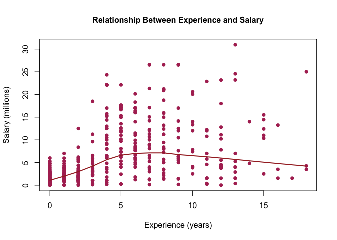
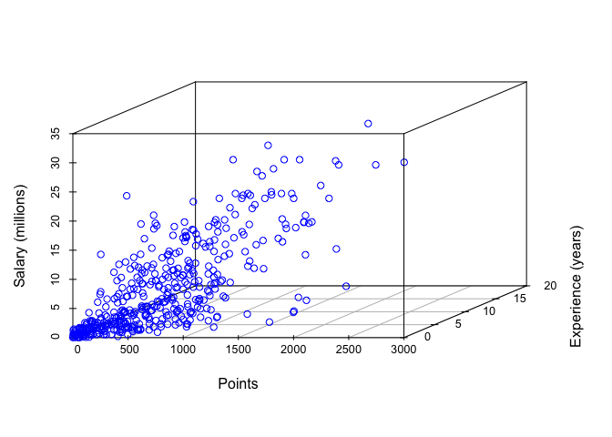
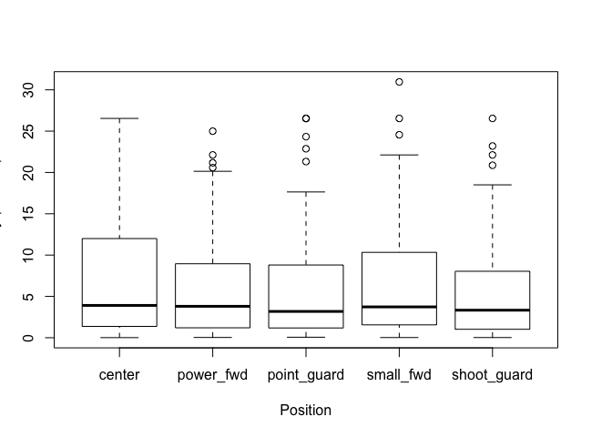

Homework 1: Summarizing Variables
================
Vibha Seshadri
September 18, 2017

``` r
# loading data
load("../data/nba2017-salary-points.RData")

# listing available objects
ls()
```

    ## [1] "experience" "player"     "points"     "points1"    "points2"   
    ## [6] "points3"    "position"   "salary"     "team"

#### A bit of data preprocessing

``` r
# simplifying representation of dollar quantities stored in salary
milSalary <- salary/1000000
milSalary <- round(milSalary, digits = 2)
```

``` r
# creating a new vector that holds numeric representation of experience, which was previously a vector of type char
experience <- replace(experience, experience == "R", "0")
experience <- as.integer(experience)
```

``` r
# changing variable position from character vector to factor with more descriptive labels
position <- factor(position, labels = c("center", "power_fwd", "point_guard", "small_fwd", "shoot_guard"))

# calculate frequency of positions in factor which contains data about positions
table(position)
```

    ## position
    ##      center   power_fwd point_guard   small_fwd shoot_guard 
    ##          89          89          85          83          95

#### Scatterplot of `points` and `salary`

``` r
# creating a scatterplot to analyze the relationship between points and salary
plot(points, milSalary, xlab = "Points", ylab = "Salary (millions)", 
     main = "Relationship Between Points and Salary", col = c("light blue"),
     cex.main = "1", cex.lab = "1", pch = 16)
```


The scatterplot above illustrates a positive relationship between the number of `points` a player makes and his resulting `salary`. The majority of the data is clustered in the lower left corner of the scatterplot, and begins to uncluster and grow with a positive slope as players gain more than 432 total points. There are, however, many points on the graph which do not follow the positive trend of the majority of points. The most total points a player has made is 2558 points, but this player does not have the highest salary. This player with 2558 points has a salary of $26.54. The highest salary appears to be around $30.96 dollars and is the salary of a player who has a total of 1954 points.

#### Correlation between `points` and `salary`

``` r
# Calculating number of individuals
n <- length(player)
n
```

    ## [1] 441

``` r
# Calculating the mean of variable X (points)
meanX <- (1/n) * sum(points)
meanX
```

    ## [1] 546.6054

``` r
# Calculating the mean of Y (milSalary)
meanY <- (1/n) * sum(milSalary)
meanY
```

    ## [1] 6.186689

``` r
# Calculating variance of X (points)
varX <- (1/(n-1)) * sum((points - meanX) ^ 2)
varX
```

    ## [1] 239136.2

``` r
# Calculating variance of Y (milSalary)
varY <- (1/(n-1)) * sum((milSalary - meanY) ^ 2)
varY
```

    ## [1] 43.19524

``` r
# Standard deviation of X (points)
sdX <- (varX) ^ (1/2)
sdX
```

    ## [1] 489.0156

``` r
# Standard deviation of Y (milSalary)
sdY <- (varY) ^ (1/2)
sdY
```

    ## [1] 6.572309

``` r
# Covariance between X (points) and Y (milSalary)
covXY <- (1/(n-1)) * sum((points - meanX) * (milSalary-meanY))
covXY
```

    ## [1] 2046.424

``` r
# Correlation between X (points) and Y (milSalary)
corXY <- covXY/(sdY * sdX)
corXY
```

    ## [1] 0.6367296

#### Simple Linear Regression

``` r
# Calculating b1, slope
b1 <- corXY * (sdY/sdX)

# Calculating b0, intercept
b0 <- meanY - b1 * meanX

# Calculating y-hat, predicted salary
yHat <- b0 + b1 * points

# Summary statistics of vector yHat (salary in millions)
summary(yHat)
```

    ##    Min. 1st Qu.  Median    Mean 3rd Qu.    Max. 
    ##   1.509   2.844   5.206   6.187   8.184  23.399

The regression equation is `ŷ = b0 + b1X`. You can interpret the slope, `b1`, as the amount, in millions of dollars, a player's salary will increase for each point they gain in their career in the NBA. You can interpret the intercept, `b0`, as the amount a player makes in millions of dollars when they begin their career, or when they have earned 0 points total in the NBA.

``` r
# Predicted salary (in millions) for player with 0 points
b0 + b1 * 0
```

    ## [1] 1.509077

``` r
# Predicted salary (in millions) for player with 100 points
b0 + b1 * 100
```

    ## [1] 2.364833

``` r
# Predicted salary (in millions) for player with 500 points
b0 + b1 * 500
```

    ## [1] 5.78786

``` r
# Predicted salary (in millions) for player with 1000 points
b0 + b1 * 1000
```

    ## [1] 10.06664

``` r
# Predicted salary (in millions) for player with 2000 points
b0 + b1 * 2000
```

    ## [1] 18.62421

#### Plotting the regression line

``` r
plot(points, milSalary, xlab = "Points", ylab = "Salary (millions)", 
     main = "Relationship Between Points and Salary", col = c("light blue"),
     cex.main = "1", cex.lab = "1", pch = 16)
abline(a = b0, b = b1, col = "black", lwd = 2)
text(2300, 20, labels = "regression", pos = 1)
lines(lowess(points, milSalary), col = "brown", lwd = 2)
text(2300, 30, labels = "lowess")
```


#### Regression Residuals and Coefficient of Determination

``` r
# Calculating the residual for milSalary
residual <- milSalary - yHat
summary(residual)
```

    ##    Min. 1st Qu.  Median    Mean 3rd Qu.    Max. 
    ## -14.187  -2.792  -1.095   0.000   2.556  18.814

``` r
# Calculating the residual sum of squares
residSumSquare <- sum(residual ^ 2)
residSumSquare
```

    ## [1] 11300.45

``` r
# Calculating total sum of squares
totSumSquare <- sum((milSalary - meanY) ^ 2)
totSumSquare
```

    ## [1] 19005.91

``` r
#Calculating the coeffiecient of determination
rSquared <- 1 - (residSumSquare/totSumSquare)
rSquared
```

    ## [1] 0.4054246

#### Exploring `position` and `experience` in relation to `milSalary`

``` r
library(scatterplot3d)
# Creating scatterplot relating milSalary to experience
plot(experience, milSalary, xlab = "Experience (years)", ylab = "Salary (millions)", 
     main = "Relationship Between Experience and Salary", col = c("maroon"),
     cex.main = "1", cex.lab = "1", pch = 16)
lines(lowess(experience, milSalary), col = "brown", lwd = 2)
```



``` r
# Creating 3D scatterplot to explore relationship between points, experience, and salary
scatterplot3d(points, experience, milSalary, color = "blue", xlab = "Points", zlab = "Salary (millions)", ylab = "Experience (years)")
```



``` r
# Creating a boxplot exploring the relationship between position and milSalary
boxplot(milSalary ~ position, xlab =  "Position", ylab = "Salary (Millions)")
```



##### Descriptive analysis of the previous scatterplot, scatterplot3D, and boxplot

-   **Scatterplot**

Since there is not a clear pattern in the scatterplot relating `experience` (in years) and `salary` (in millions), there does not appear to be a relationship between a NBA basketball player's experience playing professionally and his salary. The points in this scatterplot are evenly spread both horizontally and vertically.

-   **Conditional boxplot**

Although all the boxplots are skewed towards larger salaries and have varying ranges, since the median of the five boxplots are essentially the same, it seems that a player's position does not have an impact on the salary they make.

-   **3D scatterplot**

The shape of the 3D scatterplot resembles the shape of the 2D scatterplot between `points` and `salary`. The 3D scatterplot looks as if the `experience` data points do not influence the shape of the plot to be different than the shape of the plot in the aforementioned 2D scatterplot.

#### Comments and Reflections

I think that it is really amazing you can create comprehensive graphs and plots using R. That being said, sometimes it's difficult to get the graphs to look as you want them to. For instance, I spent a lot of time trying to get abline to work because I had calculated the slope and intercept using `salary`, but was placing the regression line on a plot which had a Y scale of salary in millions. I had to go back and change any line of code where I used `salary` to use `milSalary` instead. When I was stuck on an aspect of this assignment, I would just google my question and see how others had gone about solving the same problems I was having, go to office hours, or go over the concept with a friend. I think the hardest part of the assignment was figuring out how to get the regression line to appear on the scatterplot showcasing the relationship between `points` and `salary` as well as the accompanying text to appear under the regression line.
