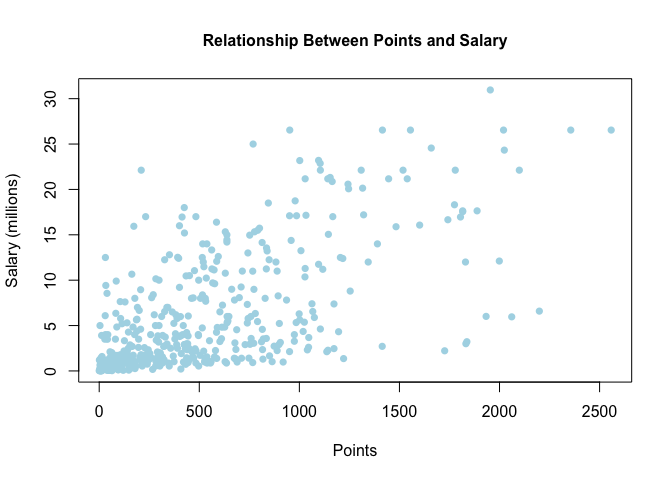
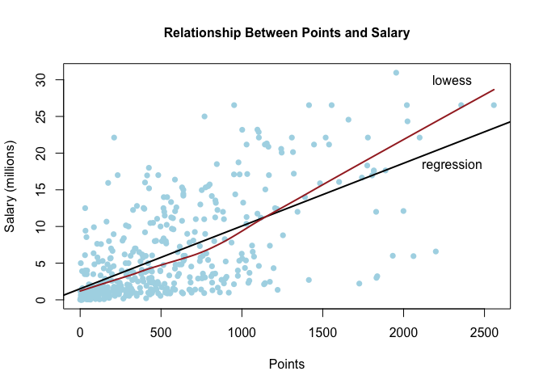

Homework 1: Summarizing Variables
================
Vibha Seshadri
September 18, 2017

``` r
# loading data
load("../data/nba2017-salary-points.RData")

# listing available objects
ls()
```

    ## [1] "experience" "player"     "points"     "points1"    "points2"   
    ## [6] "points3"    "position"   "salary"     "team"

#### A bit of data preprocessing

``` r
# simplifying representation of dollar quantities stored in salary
milSalary <- salary/1000000
milSalary <- round(milSalary, digits = 2)
```

``` r
# creating a new vector that holds numeric representation of experience, previously a vector of type char
experience <- replace(experience, experience == "R", "0")
experience <- as.integer(experience)
```

``` r
# changing variable position from character vector to factor with more descriptive labels
position <- factor(position, labels = c("center", "power_fwd", "point_guard", "small_fwd", "shoot_guard"))

# calculate frequency of positions in factor, position
table(position)
```

    ## position
    ##      center   power_fwd point_guard   small_fwd shoot_guard 
    ##          89          89          85          83          95

#### Scatterplot of `points` and `salary`

``` r
# creating a scatterplot to analyze the relationship between points and salary
plot(points, milSalary, xlab = "Points", ylab = "Salary (millions)", 
     main = "Relationship Between Points and Salary", col = c("light blue"),
     cex.main = "1", cex.lab = "1", pch = 16)
```



The scatterplot above illustrates a positive relationship between the number of `points` a player makes and his resulting `salary`. The majority of the data is clustered in the lower left corner of the scatterplot, and begins to uncluster and grow with a positive slope as players gain more than 432 total points. There are, however, many points on the graph which do not follow the positive trend of the majority of points. The most total points a player has made is 2558 points, but this player does not have the highest salary. This player with 2558 has a salary of $26.54. The highest salary appears to be around $30.96 dollars and is the salary of a player who has a total of 1954 points.

#### Correlation between `points` and `salary`

``` r
# Calculating number of individuals
n <- length(player)
n
```

    ## [1] 441

``` r
# Calculating the mean of variable X (points)
meanX <- (1/n) * sum(points)
meanX
```

    ## [1] 546.6054

``` r
# Calculating the mean of Y (salary)
meanY <- (1/n) * sum(salary)
meanY
```

    ## [1] 6187014

``` r
# Calculating variance of X (points)
varX <- (1/(n-1)) * sum((points - meanX) ^ 2)
varX
```

    ## [1] 239136.2

``` r
# Calculating variance of Y (salary)
varY <- (1/(n-1)) * sum((salary - meanY) ^ 2)
varY
```

    ## [1] 4.318973e+13

``` r
# Standard deviation of X (points)
sdX <- (varX) ^ (1/2)
sdX
```

    ## [1] 489.0156

``` r
# Standard deviation of Y (salary)
sdY <- (varY) ^ (1/2)
sdY
```

    ## [1] 6571890

``` r
# Covariance between X and Y
covXY <- (1/(n-1)) * sum((points - meanX) * (salary-meanY))
covXY
```

    ## [1] 2046212512

``` r
# Correlation between X and Y
corXY <- covXY/(sdY * sdX)
corXY
```

    ## [1] 0.6367043

#### Simple Linear Regression

``` r
# Calculating b1, slope
b1 <- corXY * (sdY/sdX)

# Calculating b0, intercept
b0 <- meanY - b1 * meanX

# Calculating y-hat, predicted salary
yHat <- b0 + b1 * points

# Summary statistics of vector yHat
summary(yHat)
```

    ##     Min.  1st Qu.   Median     Mean  3rd Qu.     Max. 
    ##  1509886  2844728  5206372  6187014  8184097 23397875

The above code chunk contains the regression equation `ŷ = b0 + b1X`. You can interpret the slope, `b1`, as the amount, in dollars, a player's salary will increase for each point they gain in their career in the NBA. You can interpret the intercept, `b0`, as the amount a player makes in dollars when they begin their career, or when they have earned 0 points total in the NBA.

``` r
# Predicted salary for player with 0 points
b0 + b1 * 0
```

    ## [1] 1509886

``` r
# Predicted salary for player with 100 points
b0 + b1 * 100
```

    ## [1] 2365554

``` r
# Predicted salary for player with 500 points
b0 + b1 * 500
```

    ## [1] 5788226

``` r
# Predicted salary for player with 1000 points
b0 + b1 * 1000
```

    ## [1] 10066566

``` r
# Predicted salary for player with 2000 points
b0 + b1 * 2000
```

    ## [1] 18623247

#### Plotting the regression line

``` r
pReg <- plot(points, milSalary, xlab = "Points", ylab = "Salary (millions)", 
     main = "Relationship Between Points and Salary", col = c("light blue"),
     cex.main = "1", cex.lab = "1", pch = 16)
# reg <- lm(points ~ salary, data = yHat)
# coeff = coefficients(reg)
# abline(reg, a = b0, b = b1, col = c("black"), lwd = 2)
abline(a = b0, b = b1, col = c("black"), lwd = 2)
```


