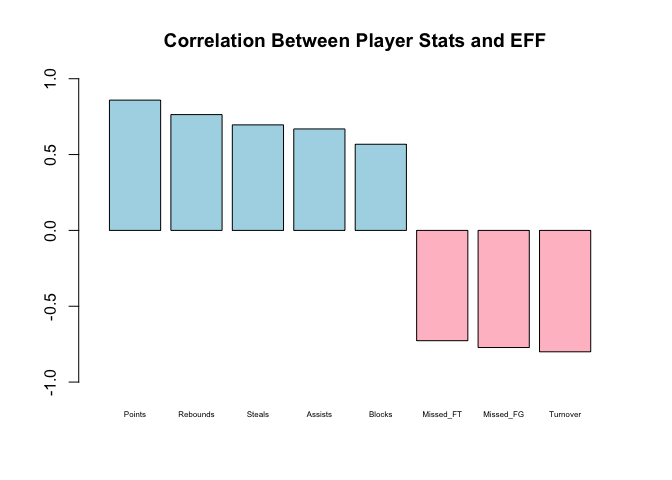

hw02-vibha-seshadri
================
Vibha Seshadri
September 29, 2017

``` r
# load packages
library(ggplot2)
library(readr)
library(dplyr)
```

#### Importing the data in R

-   Loading data using `read.csv()`

``` r
dat1 <- read.csv('../data/nba2017-player-statistics.csv', 
                 stringsAsFactors = FALSE,
                 colClasses = c("character", "character", "factor", "character", 
                                "double", rep("integer", 19))
              )
str(dat1)
```

    ## 'data.frame':    441 obs. of  24 variables:
    ##  $ Player      : chr  "Al Horford" "Amir Johnson" "Avery Bradley" "Demetrius Jackson" ...
    ##  $ Team        : chr  "BOS" "BOS" "BOS" "BOS" ...
    ##  $ Position    : Factor w/ 5 levels "C","PF","PG",..: 1 2 5 3 4 3 4 5 4 2 ...
    ##  $ Experience  : chr  "9" "11" "6" "R" ...
    ##  $ Salary      : num  26540100 12000000 8269663 1450000 1410598 ...
    ##  $ Rank        : int  4 6 5 15 11 1 3 13 8 10 ...
    ##  $ Age         : int  30 29 26 22 31 27 26 21 20 29 ...
    ##  $ GP          : int  68 80 55 5 47 76 72 29 78 78 ...
    ##  $ GS          : int  68 77 55 0 0 76 72 0 20 6 ...
    ##  $ MIN         : int  2193 1608 1835 17 538 2569 2335 220 1341 1232 ...
    ##  $ FGM         : int  379 213 359 3 95 682 333 25 192 114 ...
    ##  $ FGA         : int  801 370 775 4 232 1473 720 58 423 262 ...
    ##  $ Points3     : int  86 27 108 1 39 245 157 12 46 45 ...
    ##  $ Points3_atts: int  242 66 277 1 111 646 394 35 135 130 ...
    ##  $ Points2     : int  293 186 251 2 56 437 176 13 146 69 ...
    ##  $ Points2_atts: int  559 304 498 3 121 827 326 23 288 132 ...
    ##  $ FTM         : int  108 67 68 3 33 590 176 6 85 26 ...
    ##  $ FTA         : int  135 100 93 6 41 649 217 9 124 37 ...
    ##  $ OREB        : int  95 117 65 2 17 43 48 6 45 60 ...
    ##  $ DREB        : int  369 248 269 2 68 162 367 20 175 213 ...
    ##  $ AST         : int  337 140 121 3 33 449 155 4 64 71 ...
    ##  $ STL         : int  52 52 68 0 9 70 72 10 35 26 ...
    ##  $ BLK         : int  87 62 11 0 7 13 23 2 18 17 ...
    ##  $ TO          : int  116 77 88 0 25 210 79 4 68 39 ...

-   Loading data using `read_csv()`

``` r
dat2 <- read_csv('../data/nba2017-player-statistics.csv', col_types = list(
                   Player = col_character(),
                   Team = col_character(),
                   Position = col_factor(c("C", "PF", "PG", "SF", "SG")),
                   Experience = col_character(),
                   Salary = col_double(),
                   Rank = col_integer(),
                   Age = col_integer(),
                   GP = col_integer(),
                   GS = col_integer(),
                   MIN = col_integer(),
                   FGM = col_integer(),
                   FGA = col_integer(),
                   Points3 = col_integer(),
                   Points3_atts = col_integer(),
                   Points2 = col_integer(),
                   Points2_atts = col_integer(),
                   FTM = col_integer(),
                   FTA = col_integer(),
                   OREB = col_integer(),
                   DREB = col_integer(),
                   AST = col_integer(),
                   STL = col_integer(),
                   BLK = col_integer(),
                   TO = col_integer()
                   )
                 )
                  
str(dat2)
```

    ## Classes 'tbl_df', 'tbl' and 'data.frame':    441 obs. of  24 variables:
    ##  $ Player      : chr  "Al Horford" "Amir Johnson" "Avery Bradley" "Demetrius Jackson" ...
    ##  $ Team        : chr  "BOS" "BOS" "BOS" "BOS" ...
    ##  $ Position    : Factor w/ 5 levels "C","PF","PG",..: 1 2 5 3 4 3 4 5 4 2 ...
    ##  $ Experience  : chr  "9" "11" "6" "R" ...
    ##  $ Salary      : num  26540100 12000000 8269663 1450000 1410598 ...
    ##  $ Rank        : int  4 6 5 15 11 1 3 13 8 10 ...
    ##  $ Age         : int  30 29 26 22 31 27 26 21 20 29 ...
    ##  $ GP          : int  68 80 55 5 47 76 72 29 78 78 ...
    ##  $ GS          : int  68 77 55 0 0 76 72 0 20 6 ...
    ##  $ MIN         : int  2193 1608 1835 17 538 2569 2335 220 1341 1232 ...
    ##  $ FGM         : int  379 213 359 3 95 682 333 25 192 114 ...
    ##  $ FGA         : int  801 370 775 4 232 1473 720 58 423 262 ...
    ##  $ Points3     : int  86 27 108 1 39 245 157 12 46 45 ...
    ##  $ Points3_atts: int  242 66 277 1 111 646 394 35 135 130 ...
    ##  $ Points2     : int  293 186 251 2 56 437 176 13 146 69 ...
    ##  $ Points2_atts: int  559 304 498 3 121 827 326 23 288 132 ...
    ##  $ FTM         : int  108 67 68 3 33 590 176 6 85 26 ...
    ##  $ FTA         : int  135 100 93 6 41 649 217 9 124 37 ...
    ##  $ OREB        : int  95 117 65 2 17 43 48 6 45 60 ...
    ##  $ DREB        : int  369 248 269 2 68 162 367 20 175 213 ...
    ##  $ AST         : int  337 140 121 3 33 449 155 4 64 71 ...
    ##  $ STL         : int  52 52 68 0 9 70 72 10 35 26 ...
    ##  $ BLK         : int  87 62 11 0 7 13 23 2 18 17 ...
    ##  $ TO          : int  116 77 88 0 25 210 79 4 68 39 ...
    ##  - attr(*, "spec")=List of 2
    ##   ..$ cols   :List of 24
    ##   .. ..$ Player      : list()
    ##   .. .. ..- attr(*, "class")= chr  "collector_character" "collector"
    ##   .. ..$ Team        : list()
    ##   .. .. ..- attr(*, "class")= chr  "collector_character" "collector"
    ##   .. ..$ Position    :List of 3
    ##   .. .. ..$ levels    : chr  "C" "PF" "PG" "SF" ...
    ##   .. .. ..$ ordered   : logi FALSE
    ##   .. .. ..$ include_na: logi FALSE
    ##   .. .. ..- attr(*, "class")= chr  "collector_factor" "collector"
    ##   .. ..$ Experience  : list()
    ##   .. .. ..- attr(*, "class")= chr  "collector_character" "collector"
    ##   .. ..$ Salary      : list()
    ##   .. .. ..- attr(*, "class")= chr  "collector_double" "collector"
    ##   .. ..$ Rank        : list()
    ##   .. .. ..- attr(*, "class")= chr  "collector_integer" "collector"
    ##   .. ..$ Age         : list()
    ##   .. .. ..- attr(*, "class")= chr  "collector_integer" "collector"
    ##   .. ..$ GP          : list()
    ##   .. .. ..- attr(*, "class")= chr  "collector_integer" "collector"
    ##   .. ..$ GS          : list()
    ##   .. .. ..- attr(*, "class")= chr  "collector_integer" "collector"
    ##   .. ..$ MIN         : list()
    ##   .. .. ..- attr(*, "class")= chr  "collector_integer" "collector"
    ##   .. ..$ FGM         : list()
    ##   .. .. ..- attr(*, "class")= chr  "collector_integer" "collector"
    ##   .. ..$ FGA         : list()
    ##   .. .. ..- attr(*, "class")= chr  "collector_integer" "collector"
    ##   .. ..$ Points3     : list()
    ##   .. .. ..- attr(*, "class")= chr  "collector_integer" "collector"
    ##   .. ..$ Points3_atts: list()
    ##   .. .. ..- attr(*, "class")= chr  "collector_integer" "collector"
    ##   .. ..$ Points2     : list()
    ##   .. .. ..- attr(*, "class")= chr  "collector_integer" "collector"
    ##   .. ..$ Points2_atts: list()
    ##   .. .. ..- attr(*, "class")= chr  "collector_integer" "collector"
    ##   .. ..$ FTM         : list()
    ##   .. .. ..- attr(*, "class")= chr  "collector_integer" "collector"
    ##   .. ..$ FTA         : list()
    ##   .. .. ..- attr(*, "class")= chr  "collector_integer" "collector"
    ##   .. ..$ OREB        : list()
    ##   .. .. ..- attr(*, "class")= chr  "collector_integer" "collector"
    ##   .. ..$ DREB        : list()
    ##   .. .. ..- attr(*, "class")= chr  "collector_integer" "collector"
    ##   .. ..$ AST         : list()
    ##   .. .. ..- attr(*, "class")= chr  "collector_integer" "collector"
    ##   .. ..$ STL         : list()
    ##   .. .. ..- attr(*, "class")= chr  "collector_integer" "collector"
    ##   .. ..$ BLK         : list()
    ##   .. .. ..- attr(*, "class")= chr  "collector_integer" "collector"
    ##   .. ..$ TO          : list()
    ##   .. .. ..- attr(*, "class")= chr  "collector_integer" "collector"
    ##   ..$ default: list()
    ##   .. ..- attr(*, "class")= chr  "collector_guess" "collector"
    ##   ..- attr(*, "class")= chr "col_spec"

#### Right after importing the data

-   Coercing `Experience` to be an integer vector

``` r
dat1$Experience[dat1$Experience == "R"] <- "0"
dat1$Experience <- as.integer(dat1$Experience)
```

#### Performance of players

``` r
# Adding EFF Column
dat1 <- mutate(dat1, "Missed_FG" = FGA - FGM, "Missed_FT" = FTA - FTM, "PTS" = Points2*2 + Points3*3 + FTM, REB = OREB + DREB, "MPG" = MIN/GP) 
dat1 <- mutate(dat1, "EFF" = (PTS + REB + AST + STL + BLK - Missed_FG - Missed_FT - TO) / GP)
summary(dat1$EFF)
```

    ##    Min. 1st Qu.  Median    Mean 3rd Qu.    Max. 
    ##  -0.600   5.452   9.090  10.137  13.247  33.840

``` r
# Making histogram
hist(dat1$EFF, xlab = "EFF", ylab = "Frequency", main = "Histogram of Efficiency (EFF)")
```


``` r
# Displaying player name, team, salary, and EFF value of the top-10 players in decreasing order
slice(arrange(select(dat1, Player, Team, Salary, EFF), desc(EFF)), 1:10)
```

    ## # A tibble: 10 x 4
    ##                   Player  Team   Salary      EFF
    ##                    <chr> <chr>    <dbl>    <dbl>
    ##  1     Russell Westbrook   OKC 26540100 33.83951
    ##  2          James Harden   HOU 26540100 32.34568
    ##  3         Anthony Davis   NOP 22116750 31.16000
    ##  4          LeBron James   CLE 30963450 30.97297
    ##  5    Karl-Anthony Towns   MIN  5960160 30.32927
    ##  6          Kevin Durant   GSW 26540100 30.19355
    ##  7 Giannis Antetokounmpo   MIL  2995421 28.37500
    ##  8      DeMarcus Cousins   NOP 16957900 27.94118
    ##  9          Jimmy Butler   CHI 17552209 25.60526
    ## 10      Hassan Whiteside   MIA 22116750 25.36364

``` r
# Names of players that have negative EFF
select(filter(dat1, EFF < 0), Player)
```

    ##            Player
    ## 1 Patricio Garino

``` r
# Using cor() to compute the correlation coefficients between EFF and all the variables used in the EFF formula

PTS_cor <- cor(dat1$PTS, dat1$EFF)
REB_cor <- cor(dat1$REB, dat1$EFF)
AST_cor <- cor(dat1$AST, dat1$EFF)
STL_cor <- cor(dat1$STL, dat1$EFF)
BLK_cor <- cor(dat1$BLK, dat1$EFF)
Missed_FG_cor <- cor(dat1$Missed_FG, dat1$EFF) * -1
Missed_FT_cor <- cor(dat1$Missed_FT, dat1$EFF) * -1 
TO_cor <- cor(dat1$TO, dat1$EFF) * -1
core_data_frame <- data.frame(
  correlations = c('Points', 'Rebounds', 'Assists', 'Steal', 'Block', 'Missed_FG', 'Missed_FT', 'Turnover'),
  values = c(PTS_cor, REB_cor, AST_cor, STL_cor, BLK_cor, Missed_FG_cor, Missed_FT_cor, TO_cor)
)
core_data_frame <- arrange(core_data_frame, desc(core_data_frame$values))
barplot(core_data_frame$values, names.arg = core_data_frame$correlations, main = "Correlation Between Player Stats and EFF", width = 1, xlim = c(0,10), cex.names = 0.5, ylim = c(-1, 1))
```



#### Effeciency and Salary

``` r
# Creating scatterplot of data frame, dat1, between Efficiency and Salary
ggplot(data = dat1, aes(x = EFF, y = Salary), xlab = Efficiency, ylab = Salary) +
  geom_point() +
  geom_smooth(method = loess)
```


``` r
# Linear Correlation Coefficient between Salary and Efficiency
cor(dat1$EFF, dat1$Salary)
```

    ## [1] 0.655624

``` r
# Taking a look at more established players and their salaries
players2 <- filter(dat1, MPG >= 20)
```

Since the linear correlation coefficient, 0.655624, between `Efficiency` and `Salary` for all NBA players is positive, and the data points in the scatterplot are grouped close to each other, there seems to be a positive relationship between a player's `Efficiency` and `Salary`.

``` r
# Creating scatterplot of data frame, players2, between Efficiency and Salary
ggplot(data = players2, aes(x = EFF, y = Salary), xlab = Efficiency, ylab = Salary) +
  geom_point() +
  geom_smooth(method = loess)
```


``` r
# Linear Correlation Coefficient between Salary and Efficiency
cor(players2$EFF, players2$Salary)
```

    ## [1] 0.5367224

The linear correlation coefficient, 0.5367224, between `Efficiency` and `Salary` for more established NBA players is positive but less than the linear correlation coefficient between `Efficiency` and `Salary` of all NBA players.
