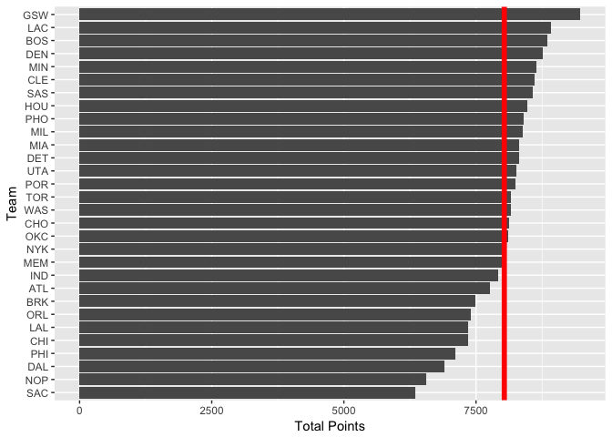

HW3: Ranking NBA Teams
================
Vibha Seshadri
October 13, 2017

``` r
library(readr)
library(ggplot2)
library(dplyr)
```

    ## Warning: package 'dplyr' was built under R version 3.4.2

    ## 
    ## Attaching package: 'dplyr'

    ## The following objects are masked from 'package:stats':
    ## 
    ##     filter, lag

    ## The following objects are masked from 'package:base':
    ## 
    ##     intersect, setdiff, setequal, union

**Importing teams data**

``` r
teams <- read_csv("../data/nba2017-teams.csv")
```

    ## Parsed with column specification:
    ## cols(
    ##   team = col_character(),
    ##   experience = col_integer(),
    ##   salary = col_integer(),
    ##   points3 = col_integer(),
    ##   points2 = col_integer(),
    ##   free_throws = col_integer(),
    ##   points = col_integer(),
    ##   off_rebounds = col_integer(),
    ##   def_rebounds = col_integer(),
    ##   assists = col_integer(),
    ##   steals = col_integer(),
    ##   blocks = col_integer(),
    ##   turnovers = col_integer(),
    ##   fouls = col_integer(),
    ##   efficiency = col_double()
    ## )

#### Ranking of Teams

**Basic Rankings**

``` r
# Arranging teams by salary in decreasing order
rank_salary <- teams %>% arrange(desc(salary))

# Creatng a horizontal bar chart based on salary
ggplot(rank_salary, aes(x = reorder(team, salary), y = salary/1000000)) +
  geom_bar(stat='identity') + 
  labs(x = "Team", y = "Salary (in Millions)") +
  geom_hline(aes(yintercept = mean(salary/1000000)), colour = "red", lwd = 2) + 
  coord_flip()
```


``` r
# Arranging teams by points in decreasing order
rank_points <- teams %>% arrange(desc(points))

# Creatng a horizontal bar chart based on points
ggplot(rank_points, aes(x = reorder(team, points), y = points)) +
  geom_bar(stat='identity') + 
  labs(x = "Team", y = "Total Points") +
  geom_hline(aes(yintercept = mean(points)), colour = "red", lwd = 2) + 
  coord_flip()
```



``` r
# Arranging teams by efficiency in decreasing order
rank_eff <- teams %>% arrange(desc(efficiency))

# Creatng a horizontal bar chart based on efficiency
ggplot(rank_eff, aes(x = reorder(team, efficiency), y = efficiency)) +
  geom_bar(stat='identity') + 
  labs(x = "Team", y = "Total Efficiency") +
  geom_hline(aes(yintercept = mean(efficiency)), colour = "red", lwd = 2) + 
  coord_flip()
```


Based on the above basic rankings, it seems that -When the ranking is based on `Salary (in millions)`, The Cleveland Cavaliers come first, followed by the Los Angeles Clippers, and finally come the Toronto Raptors -When the ranking is based on `Total Points`, The Golden State Warriors come first, followed by the Los Angeles Clippers, and finally come the Boston Celtics -When the ranking is based on `Total Efficiency`, The Cleveland Cavaliers come first, followed by the Golden State Warriors, and finally come the Denver Nuggets

In all three methods of basic ranking, the average `Salary (in millions)`, `Points`, and `Efficiency` is quite large. In fact, many teams don't even reach the average, or just reach it, in all three of these rankings.

#### Principal Component Analysis

``` r
# Creating dataframe of objects that PCA is built from
pca_df <- teams %>% select(points3, points2, free_throws, off_rebounds,
                           def_rebounds, assists, steals, blocks, turnovers, fouls)
# Calculating PCA
pca_result <- prcomp(pca_df, scale = TRUE)

# Creating data frame of eigenvalues and proportions. Information used to create this data frame
# came from the output of summary(pca_result)
eigen_df <- data.frame(eigenvalue = round(pca_result$sdev^2, digits = 4),
                       prop = round(pca_result$sdev^2/sum(pca_result$sdev^2), 4),
                       cumprop = round(cumsum(pca_result$sdev^2/sum(pca_result$sdev^2)),
                                  digits = 4)
                      )
```

``` r
#Creating a data frame which relates teams to their respective PC1 and PC2
with_pc12 <- data.frame(team = teams$team,
                        PC1 = pca_result$x[ , "PC1"], 
                        PC2 = pca_result$x[ , "PC2"])

#Creating a scatterplot of PC1 and PC2
ggplot(with_pc12, aes(x = PC1, y = PC2)) + 
  geom_point() + 
  ggtitle("PCA Plot (PC1 and PC2)") +
  geom_label(aes(label = team)) + 
  geom_vline(xintercept = 0, color = "black") + 
  geom_hline(yintercept = 0, color = "black")
```


#### Index based on PC1

``` r
PC1 <- pca_result$x[ , "PC1"]

# Transforming first PC
PC1_transformed <- 100*((PC1 - min(PC1)))/(max(PC1) - min(PC1))

# Creating data frame with transformed PC
index_PC1 <- data.frame(team = teams$team, PC1 = PC1_transformed)

# Arranging index_PC1 dataframe to be arranged in decreasing order based on the transformed PC1
index_PC1 <- index_PC1 %>% arrange(desc(PC1))

# Creatng a horizontal bar chart based on transformed PC1
ggplot(index_PC1, aes(x = reorder(team, PC1), y = PC1)) +
  geom_bar(stat='identity') + 
  labs(x = "Team", y = "First PC (Scaled from 0 to 100)") +
  coord_flip()
```


Based on the PC1 index to rank teams, the Golden State Warriors come first in the rankings, followed by the Minnesota Golden Gophers, and finally come the San Antonio Spurs. The PC1 index captures the maximum variance of each of the variables in such a way that they are mutually uncorrelated. This essentially means that the eigenvalues of each of the eigenvectors is as large as possible. This PC1 index is scaled to be between 0 and 100, which helps with readability. The PC1 index provides a way to standardize all the variables associated with all teams because we bring the dimensionality of the variables down and focus on the variable which contribute the greatest eigenvalues. Therefore, when teams are ranked based on PC they are ranked on a standardized scale that takes into account all influential variables as opposed to just one variable, which we did in the Basic Ranking, which can vary for a variety of reasons.

#### Comments and Reflections

I really enjoyed this homework assignment! I am taking Math 54 this semester and we are currently learning about Eigenvalues, Eigenvectors, and Dimensionality so I loved seeing how those concepts related to statistics and practicing how to use these concepts with R. The hardest part of the assignment was definitely figuring out what each part of the output from `prcomp()` meant and how that related to PCs, but reading the lecture slides from our lecture on PCA was really helpful. Also, reading this [stack exchange](https://stats.stackexchange.com/questions/102658/why-does-pca-maximize-total-variance-of-the-projection) post was helpful in understanding why we want the most variance when calculating PCs. I think the hardest part of this assignment was figuring out how to create the teams data frame. I also really liked that we used an R script for our data processing in this assignment. I felt like I had ownership of more the process from data cleaning, to analysis, to reporting.
