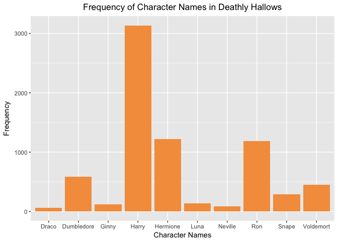
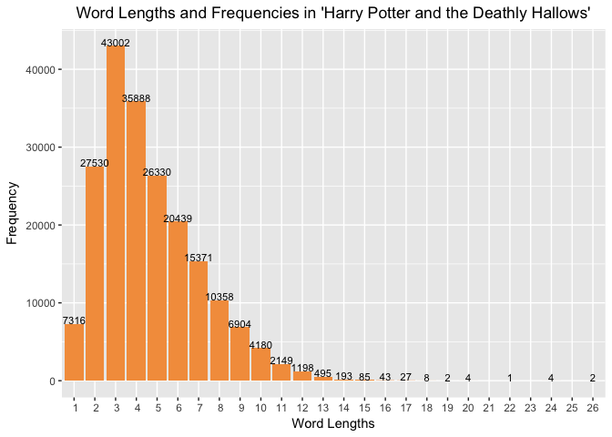

post02-vibha-seshadri
================
Vibha Seshadri
November 20, 2017

Stringr and Regex: A Force to Reckon With
-----------------------------------------

 

Before we begin, let's load all the packages we will need for the examples used in this post! If you don't have some of these packages, use the `install.packages` command in your R console to install them.

``` r
# load stringr package
library(stringr)

# load ggplot2 package
library(ggplot2)
```

#### Introduction

I'm just going to start off by saying that I am a **BIG** *Harry Potter* fan. My favorite book in the series was *Harry Potter and the Deathly Hallows*! I loved how well J.K. Rowling tied everything in the series together with so much attention to detail and depth! That's why in this blog post, I am going to explain how we can use regex and the methods in the `stringr` package to analyze the master piece that is the text of the seventh *Harry Potter* book! Let's begin!

#### What exactly is regex?

[According to the regex rdocumentation](https://www.rdocumentation.org/packages/base/versions/3.4.1/topics/regex), regex stands for "Regular Expression" and "speficies a pattern which describes a set of strings." Regex has specific syntax that is used in creating patterns for a computer to interpret and match. Take a look at [this cheatsheet](http://regexlib.com/CheatSheet.aspx?AspxAutoDetectCookieSupport=1) to learn more about regex syntax! There are many uses of Regex. [According to Rex Egg](http://www.rexegg.com/regex-uses.html), a website that contains many regex tutorials, regex can be used in getting text from a file, validating input from users in forms, searching for and replacing pages of code, utilizing the advanced search features of creativity software, renaming many files, and much more.

#### What exactly is `stringr`?

`stringr` is a package in `R` that allows for easy string manipulation and pattern matching in character vectors. [According to the cran.r webpage on stringr](https://cran.r-project.org/web/packages/stringr/vignettes/stringr.html), `stringr` supports four types of operations: character manipulations, whitespace manipulations, locale operations (ie changing case or sorting a vector), and pattern matching functions. [According to the stringr rdocumentation](https://www.rdocumentation.org/packages/stringr/versions/1.1.0), `stringr` was created by Hadley Wickham and provides a consistent manner in which you can work with strings because "all functions and argument names are consistent, and all functions deal with missing values in the same way." This is what allows `stringr` to support the piping operator (`%>%`) and use the output of one `stringr` function as the input to another `stringr` function.

If you have some experience with string manipulation using base R string functions, you might wonder why we even need `stringr` since the base R functions are quite powerful already. Well, that is true, but [according to Hadley Wickham](https://journal.r-project.org/archive/2010/RJ-2010-012/RJ-2010-012.pdf) the base R functions are not consistent and "lag behind" functions available in other programming languages. `stringr` functions are very consistent, powerful, easy to learn, and more aligned with string functions available in other programing languages.

#### Motivation

So exactly why am I explaining how to use `stringr` to analyze text? Well let's just say that I want to save you the trouble of physically analyzing words and patterns within a text file the next time you analyze text (because, that's what we do for fun, right?). Well the beauty of `stringr` and regex is that is allows us to pay attention to the same patterns we may have noticed without the aid of technology, but in more detail, as well as other patterns we may have missed.

By using `stringr` in combination with regex, you can go through an entire text file and find what you are looking for in a fraction of the time it would taken you do the same thing manually! Using the string manipulation methods in `stringr` in combination with regex can be used in many situations, such as replacing many instances of the same word or phrase in one text file or finding a repeating pattern in a text file, without looping through every line in the text file. In R, you may be able to get away with using some vectorized operations on long lists of text, but in other programming languages you won't be able to do this! Luckily, regex is universal across programming languages and is a handy skill to learn to avoid looping through long pieces of text.

At this point some of you may be wondering what's so bad about using loop operations to parse an entire file in order to do string manipulation and pattern matching? Well, [according to a post by Oana Platon on the Microsoft Developer Blog](https://blogs.msdn.microsoft.com/oanapl/2009/04/04/performance-comparison-regex-versus-string-operations/) that would work, but it's a lot more work and there's a lot more room for error. For instance, if you were trying to find every word that started with the letters "app" and then return the maximum length of a word that started with "app" you could use a loop to go through your list of words, and check if the substring from the first to third index of the words matched "app". Then you could use a `max` function on a list of the length of such words, and return the maximum value. But what if you could skipping looking at each word individually all together? This is where regex makes things easy. Consider the following example.

``` r
# create example vector
ex <- c("application", "broke", "cake", "", "appelate", "eat,", "apple", "apothecary", "table", "append", "thanksgiving", "apostle", "ape", "appease")

# find all the words in ex that start with app using regex
# pattern ^app and stringr function str_detect
app <- ex[str_detect(ex, "^app")]

# get the length of words starting with app 
# using stringr function str_length
len <- str_length(app)

# return the max length
max(len)
```

    ## [1] 11

We didn't have to loop or look at any of the elements in the character vector `ex` individually! Imagine if `ex` was as long as the text of the seventh Harry Potter book and had close to a million words! We would not want to look at any word individually ourselves, but rather have words that match the description we are looking for returned to us easily. That is what regex and `stringr` functions allow us to do.

#### Examples of stringr methods and regex in action!

Follow along with the example below to learn how you can use `stringr` functions and regex to analyze the text of *Harry Potter and the Deathly Hallows*.

Let's first clean up the text file of *Harry Potter and the Deathly Hallows*. Click [here](https://ia801309.us.archive.org/15/items/Book5TheOrderOfThePhoenix/Book%207%20-%20The%20Deathly%20Hallows_djvu.txt) to go to the text file. You do not need to download the file if you follow along with the below tutorial.

``` r
# concatenate the url to get the text file
beg <- "https://ia801309.us.archive.org/15/items/Book5TheOrderOfThePhoenix/"
end <- "Book%207%20-%20The%20Deathly%20Hallows_djvu.txt"
url <- paste0(beg, end)

# read in the text file from the url
hp_seven <- readLines(url)

# get rid of lines that indicate the page number and title, as they are not 
# directly from the novel
hp_seven <- hp_seven[!str_detect(hp_seven, "Page \\| [1-9]*[0-9]")]
hp_seven <- hp_seven[!str_detect(hp_seven, 
              "Harry Potter and the Deathly Hallows - J.K. Rowling ")]

# split up the lines into words
hp_seven <- str_split(hp_seven, " ")
hp_seven <- unlist(hp_seven)

# get rid of entries in hp_seven that are empty strings
hp_seven <- hp_seven[str_detect(hp_seven, "")]
```

Let's count how many times the main characters' names are mentioned in the book and view the results in a bar plot

``` r
# get counts of each name
Hermione <- sum(str_count(hp_seven, "Hermione"))
Harry <- sum(str_count(hp_seven, "Harry"))
Ron <- sum(str_count(hp_seven, "Ron"))
Neville <- sum(str_count(hp_seven, "Neville"))
Luna <- sum(str_count(hp_seven, "Luna"))
Ginny <- sum(str_count(hp_seven, "Ginny"))
Dumbledore <- sum(str_count(hp_seven, "Dumbledore"))
Snape <- sum(str_count(hp_seven, "Snape"))
Voldemort <- sum(str_count(hp_seven, "Voldemort"))
Draco <- sum(str_count(hp_seven, "Draco"))

# create a dataframe to use with ggplot2
hp_name <- data.frame(name = c("Hermione", "Harry", "Ron", "Neville", 
                               "Luna", "Ginny", "Dumbledore", "Snape", 
                               "Voldemort", "Draco"),
                      counts = c(Hermione, Harry, Ron, Neville, 
                                 Luna, Ginny, Dumbledore, Snape,
                                 Voldemort, Draco)
                      )

# create the ggplot
ggplot() + 
  geom_bar(data = hp_name,
          aes(x = name, y = counts), stat = "identity", fill = "#f49d4b") + 
          xlab("Character Names") + 
          ylab("Frequency") + 
          ggtitle("Frequency of Character Names in Deathly Hallows") +
          theme(plot.title = element_text(hjust = 0.5))
```



Now let's try and see how many words start and end with lowercase vowels, start and end with anything but a vowel, and start with uncommon consonants!

``` r
# let's count how many words start and end with vowels
sum(str_count(hp_seven, "^[aeiou].*[aeiou]$"))
```

    ## [1] 2919

``` r
# let's count how many words start and end with anything but a vowel
sum(str_count(hp_seven, "^[^aeiou].*[^aeiou]$"))
```

    ## [1] 116349

``` r
# let's count how many words start with a v,x, or z regardless of case
sum(str_count(hp_seven, "^[vxzVXZ].*"))
```

    ## [1] 1520

``` r
# let's see which words start with an x or X
hp_seven[str_detect(hp_seven, "^[xX].*")]
```

    ##  [1] "X-raying"      "Xenophilius,"  "Xenophilius"   "Xenophilius"  
    ##  [5] "Xenophilius"   "Xenophilius,"  "Xenophilius,"  "Xenophilius"  
    ##  [9] "Xenophilius"   "Xenophilius."  "Xenophilius"   "Xeno"         
    ## [13] "Xeno"          "Xeno"          "XEN"           "Xenophilius"  
    ## [17] "X."            "Xenophilius"   "Xenophilius"   "Xenophilius"  
    ## [21] "Xenophilius."  "Xenophilius"   "Xenophilius,"  "Xenophilius," 
    ## [25] "Xenophilius."  "Xenophilius"   "Xenophilius"   "Xenophilius." 
    ## [29] "Xenophilius"   "Xenophilius"   "Xenophilius"   "Xenophilius’s"
    ## [33] "Xenophilius"   "Xenophilius"   "Xenophilius."  "Xenophilius"  
    ## [37] "Xenophilius"   "Xenophilius."  "Xenophilius,"  "Xenophilius"  
    ## [41] "Xenophilius"   "Xenophilius"   "Xenophilius"   "Xenophilius"  
    ## [45] "Xenophilius."  "Xenophilius,"  "Xenophilius"   "Xenophilius," 
    ## [49] "Xenophilius"   "Xenophilius."  "Xenophilius"   "Xenophilius," 
    ## [53] "Xenophilius."  "Xenophilius."  "Xenophilius."  "Xenophilius." 
    ## [57] "Xenophilius,"  "Xenophilius,"  "Xenophilius"   "Xenophilius," 
    ## [61] "Xenophilius."  "Xenophilius,"  "Xenophilius"   "Xenophilius"  
    ## [65] "Xenophilius"   "Xenophilius"   "Xenophilius"   "Xenophilius"  
    ## [69] "Xenophilius"   "Xenophilius"   "Xenophilius"   "Xenophilius"  
    ## [73] "Xenophilius"   "Xenophilius"   "Xenophilius’s" "Xenophilius"  
    ## [77] "Xenophilius."  "Xenophilius."  "Xenophilius."  "Xenophilius." 
    ## [81] "Xenophilius"   "Xenophilius"   "Xenophilius"   "Xenophilius"  
    ## [85] "Xenophilius"   "Xenophilius"   "Xenophilius’s" "Xenophilius"  
    ## [89] "Xenophilius"   "Xenophilius"   "Xenophilius"   "Xenophilius"  
    ## [93] "Xenophilius."  "Xenophilius’s" "X-raying"      "Xeno"         
    ## [97] "Xenophilius’s"

``` r
# let's see if any words end with a x or
sum(str_count(hp_seven, "$[xX]"))
```

    ## [1] 0

Look's like no words end with the letter x, but it seem's like the name Xenophilius is the most common value which starts with x in the text! Let's see how many times the name appears in the text.

``` r
# count how many times Xenophilius appears
sum(str_count(hp_seven, "Xenophilius."))
```

    ## [1] 36

Since this is the seventh book, let's see how many words are seven letters long!

``` r
# count how many words are seven letters long
sum(str_count(hp_seven, "^[a-zA-Z]{7}$"))
```

    ## [1] 9975

``` r
# see what the first 5 seven letter words in the novel are
head(hp_seven[str_detect(hp_seven, "^[a-zA-Z]{7}$")], n = 5)
```

    ## [1] "moonlit" "beneath" "started" "walking" "briskly"

Lastly, let's find the word length of each word of the book and analyze which word length is most common!

``` r
# get a vector which holds all of the word lengths
# use the regex wildcard symbol to get the length of 
# every element in the list
word_len <- str_count(hp_seven, ".")

# make data frame of word lengths and their frequencies
word_df <- as.data.frame(table(word_len), stringsAsFactors = FALSE)

# create a bar chart of word lengths and their frequencies
ggplot(data = word_df, aes(x = word_len, y = Freq)) +
  geom_bar(stat = "identity", fill = "#f49d4b") +
  scale_x_discrete(limits = seq(1, 26, 1)) + 
  geom_text(data = word_df, aes(label = Freq), 
            vjust = 0, size = 3) +
  xlab("Word Lengths") +
  ylab("Frequency") +
  ggtitle("Word Lengths and Frequencies in 'Harry Potter and the Deathly Hallows'") +
  theme(plot.title = element_text(hjust = 0.5))
```



The word length that appeared most frequently were three letter words! Let's see how many times some of these three letter words appeared in the text!

``` r
# create a vector only containing words that are three words long
three <- hp_seven[str_detect(hp_seven, "^[a-zA-Z]{3}$")]

# create a frequency table of the three letter words, sorted
# in decreasing order
three_tbl <- sort(table(three), decreasing = TRUE)

# create a data frame of three letter words and their frequencies
three_df <- as.data.frame(three_tbl, stringsAsFactors = FALSE)

# display the first 20 values in the table
head(three_df, n = 20)
```

    ##    three Freq
    ## 1    the 9494
    ## 2    and 5100
    ## 3    was 2674
    ## 4    his 2492
    ## 5    had 1974
    ## 6    you 1391
    ## 7    not 1069
    ## 8    for  956
    ## 9    her  853
    ## 10   but  806
    ## 11   The  780
    ## 12   she  703
    ## 13   him  673
    ## 14   out  659
    ## 15   Ron  576
    ## 16   all  538
    ## 17   who  472
    ## 18   did  444
    ## 19   one  336
    ## 20   are  323

What were some of the least common three letter words?

``` r
# create a frequency table of the three letter words, sorted
# in increasing order
three_tbl2 <- sort(table(three), decreasing = FALSE)

# create a data frame of three letter words and their frequencies
three_df2 <- as.data.frame(three_tbl2, stringsAsFactors = FALSE)

# display the first 20 values in the table
head(three_df2, n = 20)
```

    ##    three Freq
    ## 1    aid    1
    ## 2    aim    1
    ## 3    arc    1
    ## 4    Ask    1
    ## 5    awe    1
    ## 6    bat    1
    ## 7    bay    1
    ## 8    bid    1
    ## 9    Bin    1
    ## 10   Bit    1
    ## 11   Bow    1
    ## 12   bun    1
    ## 13   bus    1
    ## 14   cap    1
    ## 15   cop    1
    ## 16   Cut    1
    ## 17   CVs    1
    ## 18   DIE    1
    ## 19   din    1
    ## 20   DOE    1

#### Conclusion

I hope you enjoyed this blog post on `stringr` and regex! Remember, the next time you want to analyze or work with text, think about how you can use the `stringr` functions in combination with regex patterns to make you're life easier! Also, there are plenty of reference guides on both [regex syntax](http://regexlib.com/CheatSheet.aspx?AspxAutoDetectCookieSupport=1) and [`stringr` documentation](https://www.rdocumentation.org/packages/stringr/versions/1.1.0). So don't feel like you have to memorize everything about them! If you understand what regex and `stringr` are, you can then use the resources available to you to keep growing your knowledge and use of both regex and `stringr` functions!

Enjoy!

#### References

-   [Where I got the Harry Potter book 7 text file from](https://archive.org/stream/Book5TheOrderOfThePhoenix/Book%207%20-%20The%20Deathly%20Hallows#page/n15/mode/2up)
-   [Regex v. string operations](https://blogs.msdn.microsoft.com/oanapl/2009/04/04/performance-comparison-regex-versus-string-operations/)
-   [Regex rdocumentation](https://www.rdocumentation.org/packages/base/versions/3.4.1/topics/regex)
-   [Regex cheatsheet](http://regexlib.com/CheatSheet.aspx?AspxAutoDetectCookieSupport=1)
-   [Uses of Regex](http://www.rexegg.com/regex-uses.html)
-   [stringr rdocumentation](https://www.rdocumentation.org/packages/stringr/versions/1.1.0),
-   [stringr documentation](https://cran.r-project.org/web/packages/stringr/stringr.pdf)
-   [stringr v. base R](https://journal.r-project.org/archive/2010/RJ-2010-012/RJ-2010-012.pdf)
-   [Regex and stringr basics](http://stringr.tidyverse.org/articles/regular-expressions.html)
